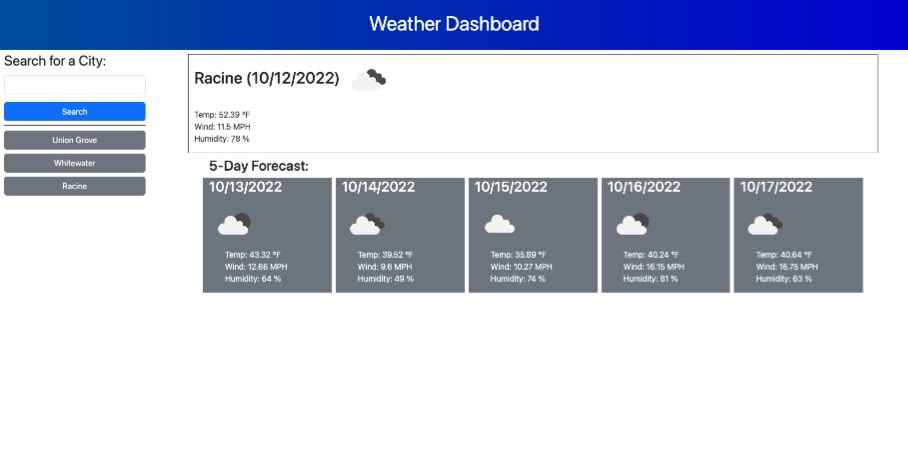

# Weather Dashboard

## Description

This dashboard serves to provide a user with weather information for a city. The app provides current data as well as the five day forecast. Building this app allowed me to practice working with server side APIs. While building the app I learned about forEach functions. This was a new idea to me but I thought it could be utilized when getting the local storage.

I also learned more about fetching data. I realized how much work it can be to take the data that comes in and actually append it into your app. It isn't hard but just a lot of lines of code.

## Table of Contents

N/A

## Installation

N/A

## Usage

To use, start by entering the city you are traveling to in the Search box then hit search. Your 1 day and 5 day forecast will show to the right and your search will be stored in past searches down below. These past searches are clickable so you can quickly go back to a previous cities weather.

Live site: https://codysaal.github.io/weather-dashboard/

## Credits

Readme template from:
https://coding-boot-camp.github.io/full-stack/github/professional-readme-guide

Guide for using forEach():
https://www.w3schools.com/jsref/jsref_forEach.asp

## License

N/A